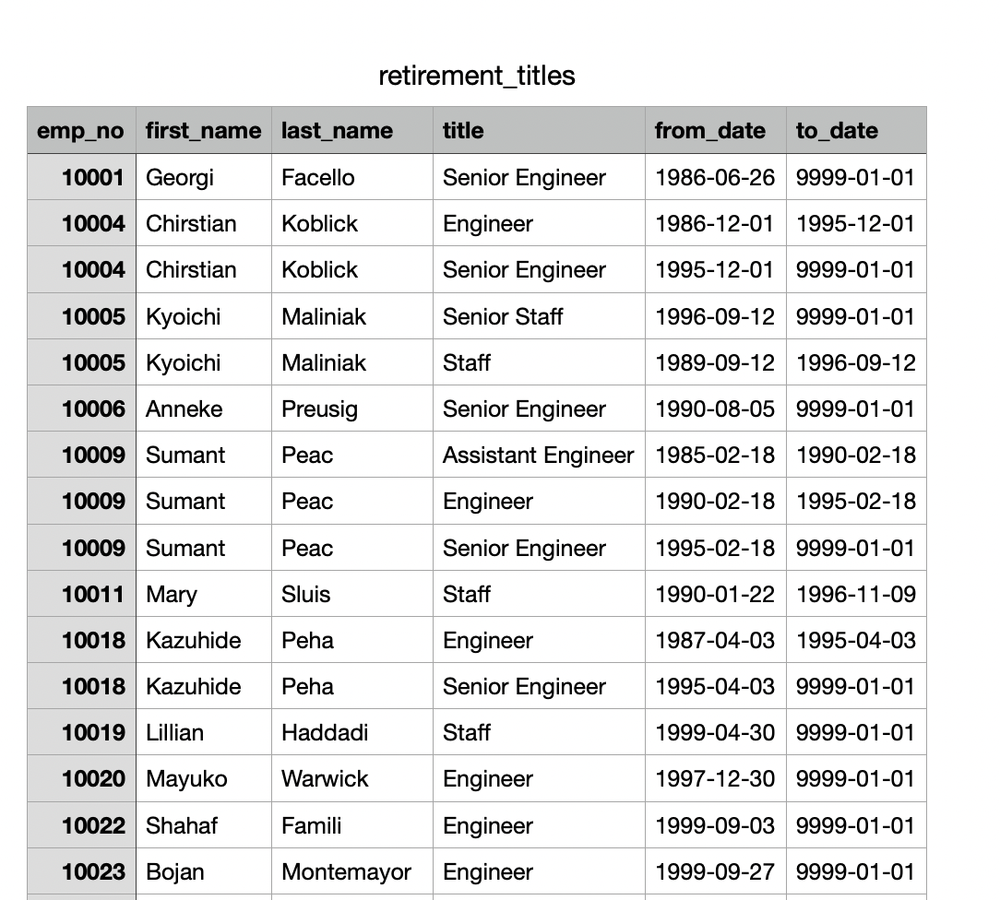
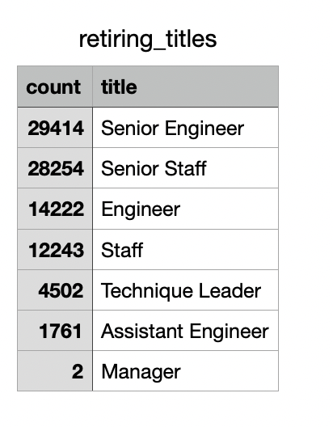
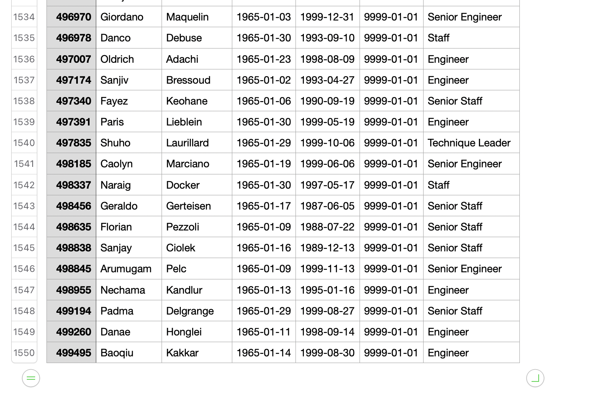

# Pewlet-Hackard-Analysis

## Analysis Overview

In this project, I will be exploring HR data for an aging compnay. The data used for this task was located in 6 different CSV files, that were in the companies HR database. After analyzing the data files, I created an entity relationship diagram (ERD) in order see how these tables related to each other. Using primary keys and foreign keys, I was able to find clear relationships between the data tables, and plan potential combinations of the tables in order to expand my database. After creating my database, I was able to query the data, this revealed a complete view of Pewlett-Hackards employees slated to retire. 

The new tables generated enabled me to demonstrate just how massive this "Silver Tsunami" was. Action was immediately taken, as a plan was set in motion to provide a mentorship program where the employees slated to retire can train those ready to make a leap in their careers.

In this challenge, I am tasked with digging deeper into the idea of a mentorship program. My analysis will help build a roadmap into this new mentorship program and positions ready to be filled, by taking a deeper look at the title of those slated to retire, as well as their eligibility to participate in this program. The combination of the two will help Pewlett-Hackard in easing the blow of the retirement wave through planning.

## Key Points

### Retirement Title

- There is a large sum of Duplicated values in the retirement_titles table. (See Below)

- The unique_titles table alleviates the issue of duplicates in the retirement_titles table.
  - The table still however shows employees who may have already retired.

- Most of our retirng employees are either Senior Engineers or Senior Staff.

### Employees Eligible for Program

- Our True Targets revealed. 
  - We see Exactly who we need to Reach out to; 1550 Employees.

## Summary

We will have approxamately 1550 qualified individuals to participate as mentors for our mentorship program. We can see that with the 'mentorship_eligibility.png' file right above.

It does not appear that Pewlett-Hackard has enough qualified individuals for a mentorship program, as the vacancies revealed to us in our retirement titles summary far outways the meer 1550 individuals that we have at our disposal. I would recommend more of a group mentorship format for the employees slated to retire, so that those who are ready to fill the posistions can still absorb knowledge from those retiring while allowing our senior leaders to go into a part time role to ease them into retirement. 
